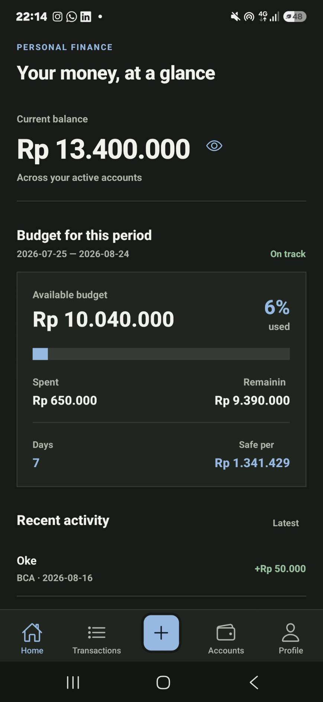
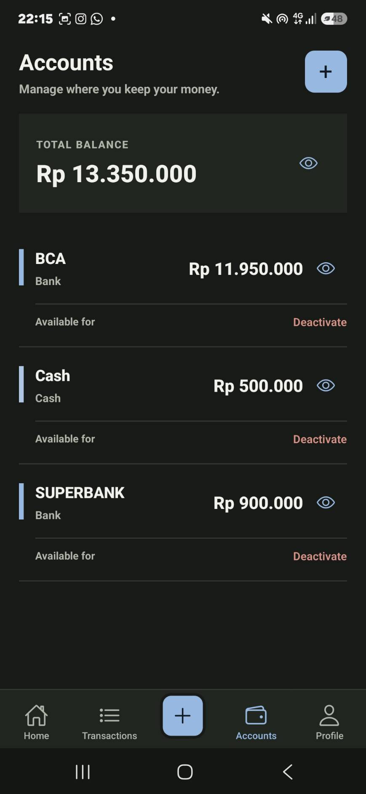
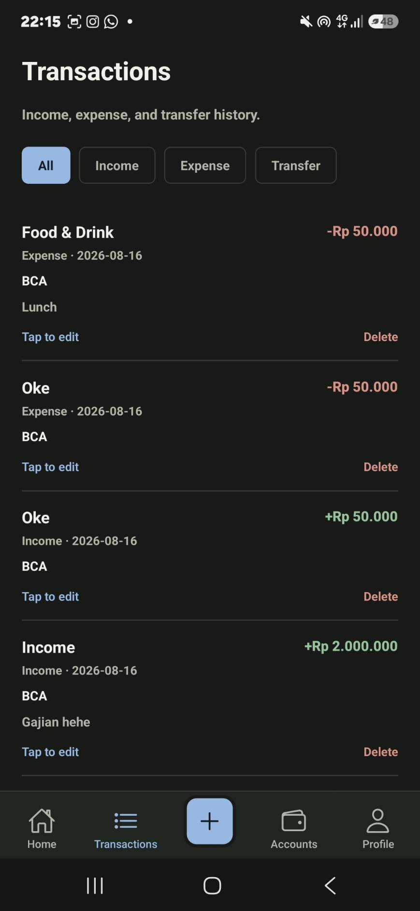
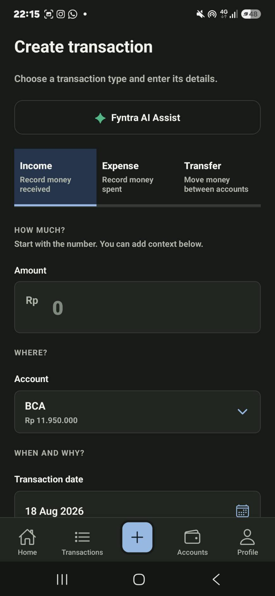
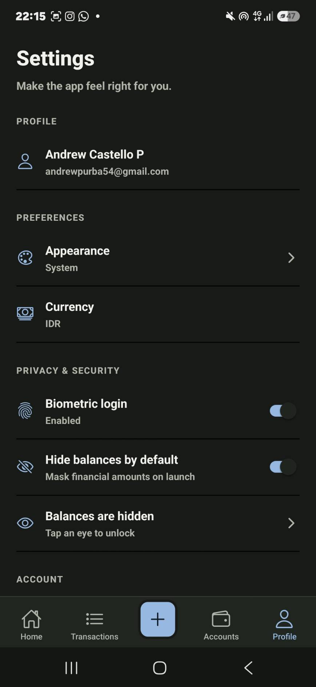

# Fyntra

> **Your money, at a glance.**

A personal finance app designed to make everyday money management clearer — from tracking transactions and accounts to understanding how much you can safely spend today.


<!--  -->

## Why Fyntra?

Most finance apps are good at showing you what already happened.

Fyntra is built around the next question:

> **How much can I spend today?**

It brings your accounts, transactions, income, spending, and current budget period together so the important information is visible without digging through numbers.

---

## ✨ Features

### 💰 Accounts

Manage multiple places where your money lives and keep their balances connected.

- Bank accounts
- Cash accounts
- Individual account balances
- Combined total balance
- Activate or deactivate accounts as needed


<!--  -->

### 💸 Transactions

Record everyday money movement in one place.

- Income
- Expenses
- Transfers between accounts
- Transaction history
- Filtering by transaction type
- Edit and delete supported transactions


<!--  -->

### 📊 Budget & Safe Daily Spend

Fyntra organizes spending around an income-based financial period.

The dashboard brings together:

- Current balance
- Active budget period
- Amount spent
- Remaining budget
- Days remaining
- Safe daily spending amount

The goal is simple: turn financial data into a number you can actually use.

> **Know what you can spend today without losing track of where your money went.**


<!--  -->

### 🤖 Fyntra AI Assist

Fyntra includes an AI assistant directly inside the transaction flow.

Instead of manually filling every field, users can describe a transaction naturally.

```text
makan 50k pakai BCA
```

Fyntra AI Assist can interpret the description and prepare a transaction draft with details such as the transaction type, amount, account, date, category, and note.

The AI is intentionally **review-first**:

```text
Natural language
       ↓
   AI Assist
       ↓
Transaction draft
       ↓
    Review
       ↓
     Save
```

**The AI does not save a transaction automatically.** The user reviews and explicitly submits the final transaction.


<!--  -->

### 🔐 Privacy & Personalization

Because Fyntra deals with personal financial information, privacy is part of the product experience.

- Biometric login
- Hide balances by default
- Unlock balances when needed
- Secure session handling
- System, light, and dark appearance modes
- Currency preferences


<!--  -->

---

## 🧠 AI Architecture

Fyntra keeps AI integration behind the backend instead of connecting the mobile app directly to an AI provider.

```text
┌─────────────────────────┐
│      Fyntra Mobile      │
│   React Native + Expo   │
└────────────┬────────────┘
             │
             │ REST API
             ▼
┌─────────────────────────┐
│      NestJS Backend     │
│                         │
│  Auth                   │
│  Business Logic         │
│  Transactions           │
│  Budgeting              │
│  AI Integration         │
└────────────┬────────────┘
             │
             ▼
┌─────────────────────────┐
│       AI Gateway        │
└────────────┬────────────┘
             │
             ▼
┌─────────────────────────┐
│       OpenRouter        │
└────────────┬────────────┘
             │
             ▼
             LLM
```

This architecture keeps the client independent from a specific model or provider and lets the backend control the AI experience.

---

## 🏗️ Architecture

```text
                 ┌──────────────────┐
                 │   Fyntra Mobile  │
                 │ React Native +   │
                 │      Expo        │
                 └────────┬─────────┘
                          │
                          ▼
                 ┌──────────────────┐
                 │   NestJS API     │
                 └───────┬──────────┘
                         │
              ┌──────────┴──────────┐
              │                     │
              ▼                     ▼
      ┌────────────────┐    ┌────────────────┐
      │ Supabase Auth  │    │  AI Gateway    │
      │ + PostgreSQL   │    └───────┬────────┘
      └────────────────┘            │
                                    ▼
                               OpenRouter
```

The mobile client handles the experience, while the backend is responsible for authentication, financial business logic, data access, and AI integration.

---

## 🛠️ Tech Stack

| Layer          | Technology                                  |
| -------------- | ------------------------------------------- |
| Mobile         | React Native, Expo, Expo Router, TypeScript |
| Backend        | NestJS, Node.js, TypeScript                 |
| Database       | PostgreSQL, Supabase                        |
| Authentication | Supabase Auth                               |
| Data Access    | Knex                                        |
| AI             | AI Gateway, OpenRouter, LLMs                |
| Testing        | Jest                                        |
| Code Quality   | ESLint, Prettier                            |

---

## 📱 Product Screens

### Home

<table>
  <tr>
    <td></td>
    <td></td>
    <td></td>
  </tr>
  <tr>
    <td align="center"><strong>Home</strong></td>
    <td align="center"><strong>Transactions</strong></td>
    <td align="center"><strong>Create Transaction</strong></td>
  </tr>
  <tr>
    <td></td>
    <td></td>
    <td></td>
  </tr>
  <tr>
    <td align="center"><strong>Accounts</strong></td>
    <td align="center"><strong>Profile & Security</strong></td>
    <td></td>
  </tr>
</table>
---

## 🚀 Getting Started

### Requirements

- Node.js
- npm
- PostgreSQL
- Expo Go or an Android/iOS emulator

### Install

```bash
git clone https://github.com/andrewcastello168/personal-daily-tracker-app.git
cd personal-daily-tracker-app
```

Install frontend dependencies:

```bash
cd apps/frontend
npm install
```

Install backend dependencies:

```bash
cd ../backend
npm install
```

Start the backend:

```bash
npm run start:dev
```

Start the mobile app in another terminal:

```bash
cd ../frontend
npm start
```

---

## About the Project

Fyntra is a full-stack mobile application built as a practical exploration of **product design, mobile development, backend engineering, financial business logic, and AI integration**.

The project focuses on making personal finance feel less like a spreadsheet and more like a useful everyday tool.

---

## Author

**Andrew Castello**

[GitHub](https://github.com/andrewcastello168)

---

> **Fyntra**  
> Track your money. Understand your spending. Spend with confidence.
