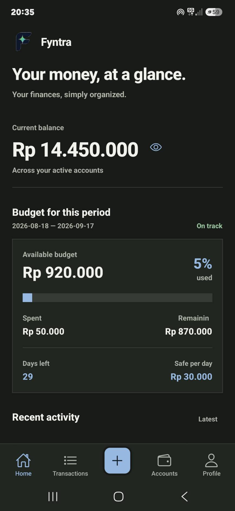
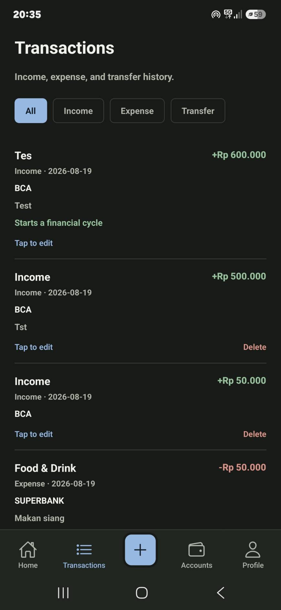
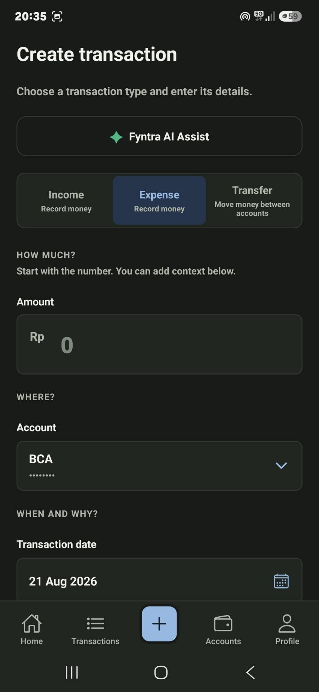
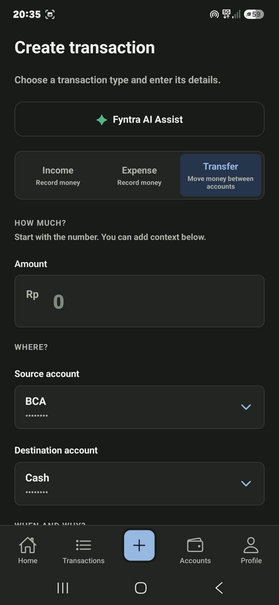
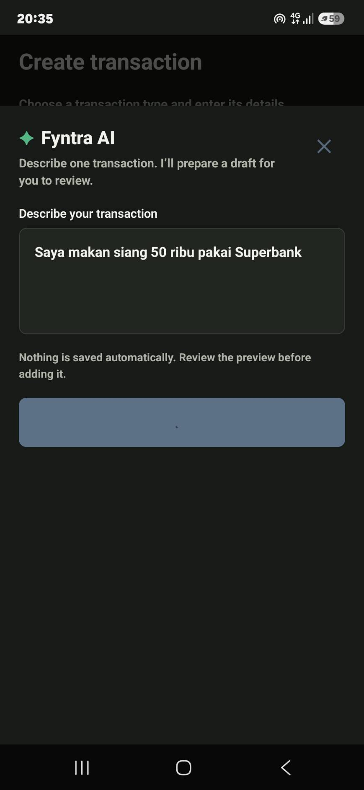
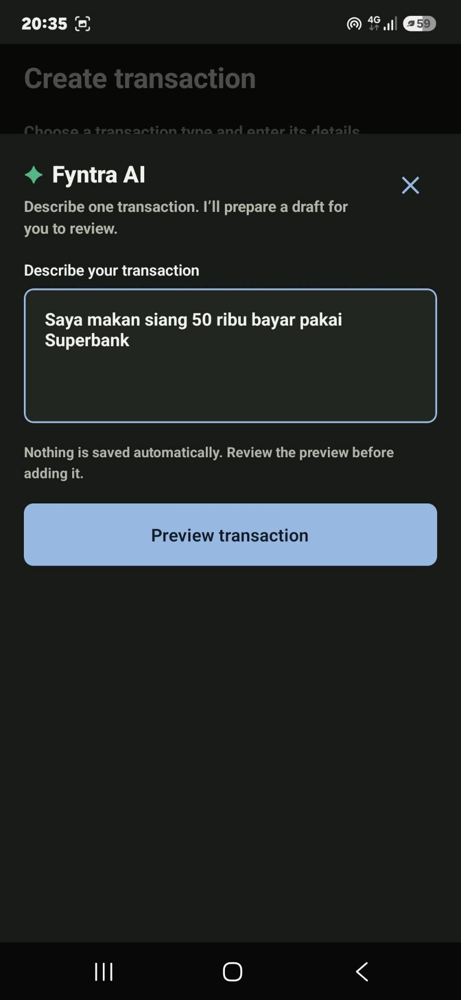
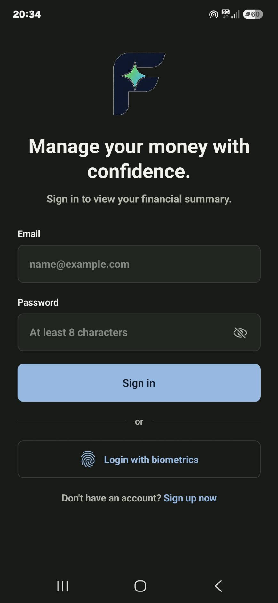
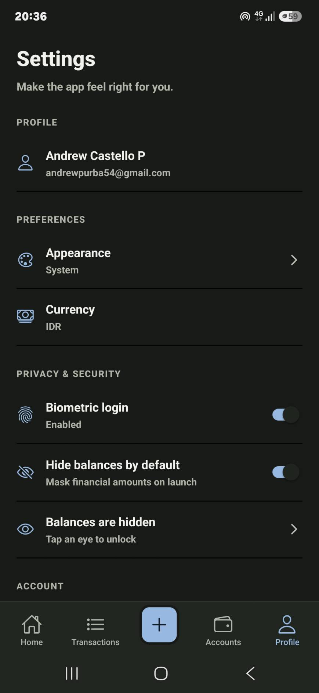
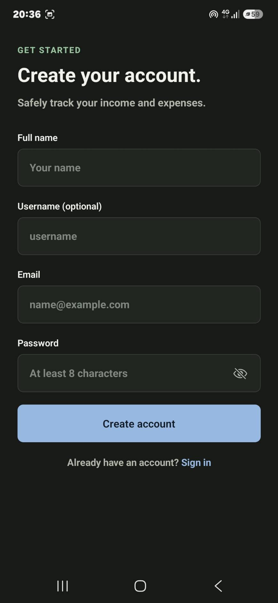

<div align="center">


<h1>Fyntra</h1>

<p><strong>Your money, at a glance.</strong></p>

<p>
A modern personal finance mobile app for tracking
<strong>income, expenses, transfers, accounts, budgets, and financial activity</strong>
— with an AI assistant that turns natural-language descriptions into transaction drafts.
</p>

<p>
  
  
  
  
</p>

<p>
  <a href="https://github.com/andrewcastello168/fyntra/releases/tag/v1.0.0">
    <strong>⬇️ Download Fyntra for Android</strong>
  </a>
</p>

</div>

---

## ✨ Overview

**Fyntra** is a personal finance tracker built around a simple idea:

> **Managing money should feel clear, fast, and intentional.**

Instead of making every transaction feel like a form, Fyntra lets users record finances through a structured workflow **or simply describe what happened in natural language** and let the AI assistant prepare a draft.

For example:

> **“Saya makan siang 50 ribu bayar pakai Superbank.”**

The assistant prepares the transaction for review before anything is saved. The user remains in control from start to finish.

---

## 📱 App Preview

<div align="center">
  
  
  
  
</div>

---

## 🚀 Features

### 💰 Financial Dashboard

See the important numbers immediately:

- Current balance across active accounts
- Budget for the current period
- Spending progress
- Remaining budget
- Days left in the period
- Safe-per-day spending amount
- Recent activity

<div align="center">
  
</div>

---

### 🧾 Transaction Management

Fyntra supports three core transaction types:

| Type         | Purpose                             |
| ------------ | ----------------------------------- |
| **Income**   | Record money coming into an account |
| **Expense**  | Record spending and categorize it   |
| **Transfer** | Move money between accounts         |

<div align="center">
  
  
</div>

Transfers use both a source and destination account so money movement is represented correctly.

<div align="center">
  
</div>

---

### ✨ Fyntra AI Assist

The AI assistant is designed around a **review-first** workflow:

```text
Describe
   ↓
Prepare draft
   ↓
Review
   ↓
Add transaction
```

Nothing is saved automatically from the AI flow.

<div align="center">
  
  
</div>

Example:

> “Saya makan siang 50 ribu bayar pakai Superbank.”

This makes transaction entry faster while keeping the final decision with the user.

---

### 📊 Transaction History

Review financial activity in a dedicated history screen with filters for:

**All · Income · Expense · Transfer**

<div align="center">
  
</div>

Transactions expose useful context such as amount, date, account, description, and transaction type.

---

### 🏦 Multiple Accounts

Track money across different accounts such as:

- Bank accounts
- Cash
- Other active financial accounts

Transfers can move money between these accounts without treating the movement as income or expense.

---

### 🔐 Privacy & Security

Fyntra includes privacy-focused controls for financial information:

- Biometric login
- Hide balances by default
- Tap-to-reveal balances
- Secure authentication flow

<div align="center">
  
  
</div>

---

### 🎨 Personalization

Settings provide a central place for:

- Profile information
- Appearance preferences
- Currency
- Biometric login
- Balance visibility
- Account controls

<div align="center">
  
</div>

---

## 🔑 Authentication

Fyntra keeps authentication intentionally simple.

### Sign In

<div align="center">
  
</div>

### Register

<div align="center">
  
</div>

Users can also sign in using biometric authentication when enabled.

---

## 🧠 Product Philosophy

Fyntra is designed around five principles:

| Principle       | Idea                                                                   |
| --------------- | ---------------------------------------------------------------------- |
| **Clarity**     | Financial information should be easy to understand at a glance.        |
| **Speed**       | Recording a transaction should take seconds, not minutes.              |
| **Control**     | AI can assist, but the user decides what gets saved.                   |
| **Privacy**     | Sensitive financial information should be easy to hide and protect.    |
| **Consistency** | The interface should feel predictable across every financial workflow. |

---

## 🎨 Visual Direction

The interface uses a focused dark theme with:

- High-contrast typography
- Blue interactive states
- Green positive financial states
- Red / warm negative financial states
- Rounded cards and input surfaces
- Strong spacing and visual hierarchy

The goal is to make the app feel **calm, premium, and financial-data focused** rather than visually noisy.

---

## 🛠️ Tech Stack

### Mobile

- **React Native**
- **Expo**
- **Expo Router**
- **TypeScript**
- **React Navigation**
- **React Native Reanimated**
- **Expo Secure Store**
- **Expo Local Authentication**
- **React Native Gesture Handler**
- **React Native Safe Area Context**

### Backend

- **NestJS**
- REST API architecture
- Authentication
- Financial data services

### Development

- **Node.js**
- **npm**
- **Git / GitHub**
- **Metro**
- Expo development workflow

---

## 📂 Project Structure

The application is organized as a workspace containing the mobile client and backend:

```text
personal-tracker-daily-app/
│
├── apps/
│   ├── frontend/              # React Native + Expo application
│   │   ├── app/               # Expo Router routes
│   │   ├── src/               # Components, auth, services, utilities
│   │   ├── assets/
│   │   └── ...
│   │
│   └── backend/               # NestJS API
│       ├── src/
│       └── ...
│
├── README.md
└── ...
```

---

## ⚡ Getting Started

### Prerequisites

Make sure you have:

- Node.js
- npm
- Expo development environment
- Android/iOS device or emulator
- Backend API available
- Environment variables configured

### 1. Install dependencies

```bash
cd apps/frontend
npm install
```

### 2. Configure environment variables

Create your frontend environment file:

```env
EXPO_PUBLIC_API_URL=http://your-api-url
EXPO_PUBLIC_APP_ENV=development
```

### 3. Start with Expo Go

```bash
npx expo start
```

Scan the QR code and open the project in **Expo Go**.

### 4. Start with a development build

```bash
npx expo start --dev-client
```

For a native development build:

```bash
npx expo run:android
```

---

## 🔄 Development Workflow

During normal React / TypeScript development, Metro + Fast Refresh lets changes appear without rebuilding the entire application:

```text
Edit source code
      ↓
Save
      ↓
Metro detects change
      ↓
Fast Refresh
      ↓
Updated screen
```

Native configuration changes may require rebuilding the development client.

---

## 🗺️ Core User Flow

```text
                    ┌──────────────┐
                    │    Sign In   │
                    └──────┬───────┘
                           │
                           ▼
                    ┌──────────────┐
                    │     Home     │
                    └──────┬───────┘
                           │
          ┌────────────────┼────────────────┐
          │                │                │
          ▼                ▼                ▼
     Transactions      Accounts         Settings
          │
          ▼
   Create Transaction
          │
      ┌───┼────┐
      │   │    │
      ▼   ▼    ▼
   Income Expense Transfer
          │
          ▼
      AI Assist
          │
          ▼
     Review Draft
          │
          ▼
        Save
```

---

## 🤖 AI Transaction Flow

The AI assistant intentionally separates **interpretation** from **confirmation**:

```text
Natural-language input
        ↓
     AI parsing
        ↓
   Transaction draft
        ↓
     User review
        ↓
   User confirmation
        ↓
   Financial record
```

This prevents an AI-generated interpretation from becoming a financial record without user approval.

---

## 🧪 Example

A user can write:

```text
Saya makan siang 50 ribu bayar pakai Superbank.
```

Instead of manually filling out every field, Fyntra can use the sentence as context for a transaction draft.

The final result is still reviewed before it is added.

---

## 🛣️ Roadmap

- [ ] Richer spending analytics
- [ ] Charts and financial insights
- [ ] Recurring transactions
- [ ] Smarter transaction categorization
- [ ] Expanded AI transaction parsing
- [ ] Export and reporting
- [ ] Deeper account analytics
- [ ] Additional localization
- [ ] More currency support
- [ ] Improved budgeting tools

---

## 📸 Screenshot Gallery

<div align="center">


</div>

---

## 📌 Project Status

Fyntra is an actively developed personal finance application combining:

**structured financial tracking + modern mobile UX + AI-assisted transaction entry**

The current application covers the essential experience from authentication to financial overview, transaction creation, account-aware transfers, AI-assisted input, transaction history, and privacy settings.

---

<div align="center">

### Built with React Native, Expo, NestJS, and ☕

**Fyntra - Your money, at a glance.**

</div>
